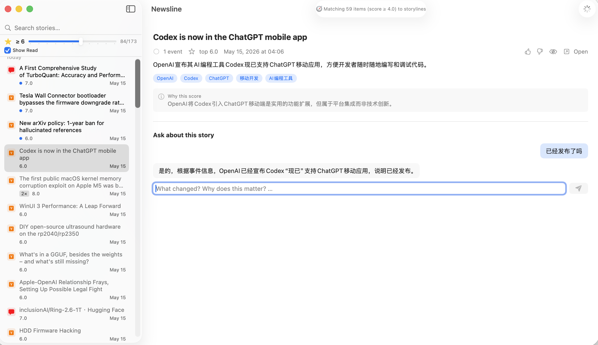

<div align="center">

# 📰 newsline

**A personal news radar that tracks _storylines_, learns your taste, and runs locally on your Mac.**

[](LICENSE)
[](https://www.apple.com/macos)
[](https://www.python.org)
[](https://swift.org)


</div>



## Why

Most news aggregators give you a flat list that resets every day. "GPT-5 released" Monday and "GPT-5 benchmarks land" Wednesday show up as two unrelated rows; the story isn't carried.

newsline builds on the same shape as [Horizon](https://github.com/Thysrael/Horizon) (fetch from many sources, score with AI, deliver a briefing) but takes three swings Horizon doesn't:

1. **Storyline tracking** — items cluster into stories that grow over time, not daily disposable rows.
2. **Personalization that learns** — open / dwell / 👍👎 / dismiss signals get recorded for a future ranker.
3. **Local-first, Mac-native** — Python daemon writes a SQLite file; a SwiftUI app reads it. No server, no account, no cloud round-trip.

## Features

- **📡 Multi-source ingest** — Hacker News, RSS / Atom (8 feeds out of the box), Reddit (subreddits via public JSON). GitHub releases & Twitter scaffolded.
- **🤖 AI scoring** — Each item rated 0-10 on a calibrated importance rubric. Pluggable provider: Anthropic, OpenAI, MiniMax (国内 & 国际 endpoints), any OpenAI-compatible URL.
- **🧭 Storyline clustering** — Entity extraction + entity-overlap inverted index + LLM verify. Cross-source items about the same event merge into one story (the "TanStack supply-chain attack" cluster from HN + r/programming was the first real-data validation).
- **📝 Evolving summaries** — When new events attach to a story, the summary is rewritten to fold in the new information. Single-event stories use their original title and AI summary.
- **💬 Chat over a story** — Streaming chat sidecar (aiohttp on 127.0.0.1) lets you ask follow-up questions grounded in the events. Multi-turn — the model carries the prior conversation. Reasoning-model `<think>` blocks suppressed.
- **🎯 Personal signals** — Opens, dwell time (≥1s), thumbs, dismiss are all written to `user_signals`. Building the data set now so a ranker has something to train on later.
- **🌐 Full Chinese support** — One config flag (`ai.language: "zh"`) flips every user-facing LLM output to 简体中文. App UI and date formatters follow your macOS language. Titles are translated while preserving repo paths, version strings, and code identifiers.
- **🖥 Native Mac reader** — SwiftUI `NavigationSplitView` with time-grouped storyline sidebar, score-filter slider, full-text search, tag-click filtering, source icons, read state, dismiss with undo, keyboard nav (`j`/`k`/`space`/`Enter`/`⌘F`), and a chat panel that streams tokens.
- **🔁 Manual or scheduled** — Tap the Fetch button in the app, or install the `com.newsline.daily` LaunchAgent for an automated daily pull.
- **📄 Markdown digest** — `news digest --days 7 --top 10` renders a shareable rollup of the recent high-score storylines.

## How it works

```
┌──────────────────────────────────────────────────────────────┐
│  Mac App (SwiftUI)                                           │
│  • read sidebar / detail   • record signals   • chat UI       │
└────────────────────┬─────────────────────────────────────────┘
                     │ SQLite (WAL) + localhost:8137 HTTP
┌────────────────────▼─────────────────────────────────────────┐
│  Python daemon                                               │
│  fetch  →  AI score  →  storyline match  →  summary rewrite  │
│                                            ↓                  │
│                                       chat sidecar (aiohttp) │
└──────────────────────────────────────────────────────────────┘
                     ▲
                     │ HTTP
        Anthropic / OpenAI / MiniMax / OpenAI-compatible
```

The Python pipeline owns the database. The Mac app reads it directly (RW connection, SELECT-only by convention — WAL mode lets the two coexist). A separate `newsline serve` HTTP sidecar handles chat streaming so the UI can render tokens as they arrive instead of waiting on a subprocess to spawn.

## Quick start

```bash
git clone https://github.com/wislonl/newsline
cd newsline
uv sync                                  # or: pip install -e .
cp .env.example .env                     # add your LLM API key
cp config.example.json config.json       # pick provider, sources, language

# Single command — builds the .app on first run, then opens it
news

# Other useful subcommands
news run            # fetch + score + match + rewrite (manual refresh)
news stories        # CLI: list active storylines
news story <id>     # CLI: show one story's timeline
news chat <id> '…'  # CLI: ground a question in one story
news digest --days 7 --top 10
news retranslate    # re-translate after switching ai.language
news where          # print local data dir
news help
```

App keyboard shortcuts: `j` / `k` next/prev, `space` advance, `Enter` open original, `⌘F` search, `⌘R` fetch, `⌘Z` undo dismiss.

## Configuration sketch

```jsonc
{
  "ai": {
    "provider": "minimax",
    "model": "MiniMax-M2.7-highspeed",
    "base_url": "https://api.minimaxi.com/v1",
    "api_key_env": "MINIMAX_API_KEY",
    "language": "zh"
  },
  "filtering": {
    "time_window_hours": 168,
    "ai_score_threshold": 4.0,
    "dormant_after_days": 30,
    "source_bias": { "hackernews": 0.0, "reddit": 0.0 }
  },
  "sources": {
    "rss": [
      { "name": "Simon Willison", "url": "https://simonwillison.net/atom/everything/" },
      { "name": "Anthropic News", "url": "https://www.anthropic.com/news/rss.xml" }
    ],
    "hackernews": { "enabled": true, "top_n": 100, "min_points": 50 },
    "reddit":     { "enabled": true, "subreddits": [
      { "subreddit": "MachineLearning", "sort": "hot", "fetch_limit": 25, "min_score": 50 }
    ]}
  }
}
```

See [`config.example.json`](config.example.json) for the full schema.

## Switching models / providers

Three built-in providers: `anthropic`, `openai`, `minimax`.

**Just change the model name** (same provider):

```jsonc
{ "ai": { "provider": "anthropic", "model": "claude-sonnet-4-5-20251022",
          "api_key_env": "ANTHROPIC_API_KEY" } }
```

**Use any OpenAI-compatible API without writing code** — set `provider: "openai"` and a `base_url`. DeepSeek, Doubao, Together, Groq, Moonshot, OpenRouter, your own proxy, etc. all work:

```jsonc
// DeepSeek
{ "ai": { "provider": "openai", "model": "deepseek-chat",
          "base_url": "https://api.deepseek.com/v1",
          "api_key_env": "DEEPSEEK_API_KEY" } }

// Groq
{ "ai": { "provider": "openai", "model": "llama-3.3-70b-versatile",
          "base_url": "https://api.groq.com/openai/v1",
          "api_key_env": "GROQ_API_KEY" } }

// Doubao (Volcengine Ark)
{ "ai": { "provider": "openai", "model": "doubao-pro-32k",
          "base_url": "https://ark.cn-beijing.volces.com/api/v3",
          "api_key_env": "DOUBAO_API_KEY" } }
```

**MiniMax has two non-interchangeable endpoints**:

```jsonc
// 国内 (platform.minimaxi.com)
{ "ai": { "provider": "minimax", "model": "MiniMax-M2.7-highspeed",
          "base_url": "https://api.minimaxi.com/v1",
          "api_key_env": "MINIMAX_API_KEY" } }

// International (api.minimax.io)
{ "ai": { "provider": "minimax", "model": "MiniMax-M2.7-highspeed",
          "base_url": "https://api.minimax.io/v1",
          "api_key_env": "MINIMAX_API_KEY" } }
```

A domestic key returns 401 against the international endpoint and vice versa. Confirm which console issued your key before setting `base_url`.

**Adding a genuinely new (non-OpenAI-compatible) provider** is a ~20-line class in [`newsline/ai/client.py`](newsline/ai/client.py) implementing `complete_json`, `complete_text`, and `stream_chat`, plus one branch in `create_client()`. The existing `AnthropicClient` and `OpenAIClient` are templates to copy.

After any provider change, drop your key into `.env` and restart the app (or run `news run` from a fresh shell so the daemon picks up the new env).

## Where your data lives

- Database: `~/Library/Application Support/newsline/newsline.db` (SQLite WAL)
- LaunchAgent: `~/Library/LaunchAgents/com.newsline.daily.plist` (when installed)
- Daemon log: `~/Library/Logs/newsline.log`

Nothing leaves your machine except the outbound calls to your configured LLM provider.

## Project structure

```
newsline/
├── newsline/                  # Python daemon
│   ├── scrapers/              # base, rss, hackernews, reddit, github, twitter, telegram
│   ├── ai/                    # client, scorer, extractor, rewriter, chatter, translator, language
│   ├── storyline/             # matcher
│   ├── services/              # email, webhook
│   ├── db.py · models.py · config.py · pipeline.py · cli.py · server.py · digest.py
├── apps/macos/                # SwiftPM macOS app
│   └── Sources/Newsline/      # NewslineApp, ContentView, Store, Signals, ChatStore,
│                              # ChatService, PipelineService, Sidecar, DBWatcher, L10n
├── scripts/                   # news, build-app.sh, install-app.sh, install-daemon.sh
└── tests/                     # pytest smoke tests
```

## Roadmap

| | Status |
|---|---|
| **M0** Python daemon + SQLite + scrapers + AI scoring | ✅ |
| **M1** Storyline engine (entity overlap + LLM verify) | ✅ |
| **M1.5** Multi-event summary rewrite + dormant archive | ✅ |
| **M2** Mac app shell (NavigationSplitView, 3-pane, watcher) | ✅ |
| **M3** Behavior signals collection (open / dwell / 👍👎 / dismiss) | ✅ |
| **M3.5** Personalized ranker on top of base score | ⏳ (need 1–2 weeks of signals) |
| **M4** Streaming chat over a story (multi-turn) | ✅ |
| **i18n** Full Chinese stack — output, UI, dates, titles | ✅ |
| **Polish** Read state · dismiss undo · keyboard nav · search · tags · auto-scroll | ✅ |
| Multi-modal sources (podcasts, YouTube transcripts) | ⏳ |
| Reddit OAuth (replace UA-spoofing) | ⏳ |
| Breaking-news push notifications | ⏳ |

## Acknowledgements

- Scrapers adapted from [Horizon](https://github.com/Thysrael/Horizon) — MIT, see [NOTICE](NOTICE).
- Mac app architecture borrowed from [Hermes Agent](https://github.com/anthropics/claude-code)'s SwiftPM-only macOS pattern.

## License

[Apache-2.0](LICENSE)
